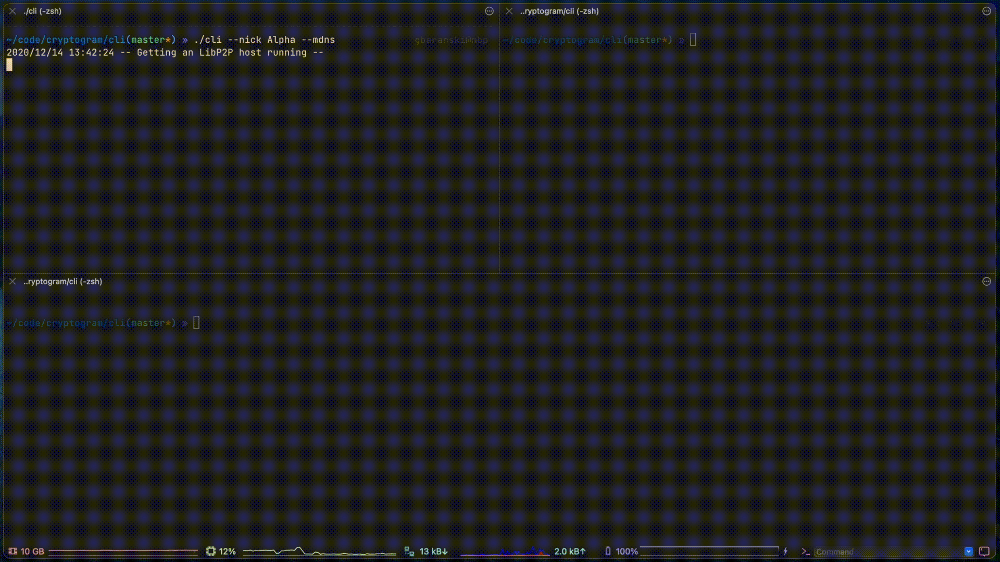

# Cryptogram
Fully decentralized P2P messaging app built on top of [LibP2P](https://libp2p.io/). Currently only CLI version is available.



## Quick start with CLI app
##### Install Go
###### macOS
```bash
brew install go
```
###### Arch Linux
```bash
sudo pacman -S go
```

#### Download repository

```bash
git clone https://github.com/gbaranski/cryptogram # Clone this repo
cd cryptogram/cli
```

#### Run directly
```bash
# Run with MDNS peer discovery, nickname will be $USER enviroment variable
go run main.go --mdns

# Run with MDNS peer discovery and custom nickname "Charlie"
go run main.go --mdns --nick Charlie 

# Run with DHT peer discovery with default bootstrap settings and custom nickname "Charlie"
go run main.go --dht --nick Charlie 
```

#### Compile to single executable
```bash
# Compile packages and dependencies into single executable
go build
# Run with DHT peer discovery with default bootstrap settings and custom nickname "Charlie"
./cli -dht --nick Charlie
```

### Configuration
| Name                        | Description                                                                                                                                |
| --------------------------- | ------------------------------------------------------------------------------------------------------------------------------------------ |
| `--nick <string>`           | Sets nickname to identify yourself, by default `$USER` env var, if not set, generates random one                                           |
| `--dht`                     | Enables DHT Peer Discovery                                                                                                                 |
| `--mdns`                    | Enables MDNS Peer Discovery                                                                                                                |
| `--mdnsinterval <seconds>`  | Configures how often MDNS packet should be sent, default: 900(15min)                                                                       |
| `--rendezvousname <string>` | Sets unique string to identify group of nodes. Share this with your friends to let them connect with you. Default: `cryptogram-rendezvous` |


## Peer discovery

Available methods of peer discovery

#### DHT Peer Discovery 
Bootstraping nodes, also known as rendezvous host, used for discovery of new peers, by default it uses the following addresses
```bash
/dnsaddr/bootstrap.libp2p.io/p2p/QmNnooDu7bfjPFoTZYxMNLWUQJyrVwtbZg5gBMjTezGAJN
/dnsaddr/bootstrap.libp2p.io/p2p/QmQCU2EcMqAqQPR2i9bChDtGNJchTbq5TbXJJ16u19uLTa
/dnsaddr/bootstrap.libp2p.io/p2p/QmbLHAnMoJPWSCR5Zhtx6BHJX9KiKNN6tpvbUcqanj75Nb
/dnsaddr/bootstrap.libp2p.io/p2p/QmcZf59bWwK5XFi76CZX8cbJ4BhTzzA3gU1ZjYZcYW3dwt
/ip4/104.131.131.82/tcp/4001/p2p/QmaCpDMGvV2BGHeYERUEnRQAwe3N8SzbUtfsmvsqQLuvuJ # mars.i.ipfs.io
```

#### MDNS Peer discovery
Multicast DNS protocol resolves peers in local network, sends UDP packet every some time to announce ourselfs